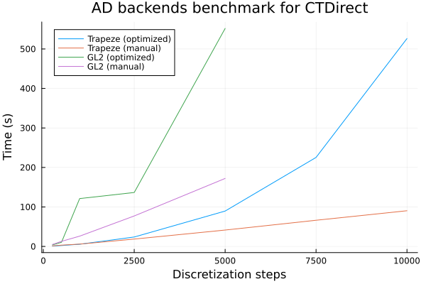

# Benchmark for different AD backends
The backend for ADNLPModels can be set in transcription / solve calls with the option `adnlp_backend=`. Possible values include the predefined(*) backends for ADNLPModels:
- `:optimized`* Default for CTDirect. Forward mode for Jacobian, reverse for Gradient and Hessian.
- `:default`* Forward mode for everything. Significantly slower.
- `:manual` Explicitely give to ADNLPModels the sparse pattern for Jacobian and Hessian. Uses the same forward / reverse settings as the `:optimized` predefined backend.  
- `:enzyme`* Enzyme (not working).
- `:zygote`* Zygote (not working).

## Errors for Enzyme and Zygote:
- enzyme gives correct nonzero counts for Jacobian and Hessian, but fails with
```
ERROR: Constant memory is stored (or returned) to a differentiable variable.
As a result, Enzyme cannot provably ensure correctness and throws this error.
This might be due to the use of a constant variable as temporary storage for active memory (https://enzyme.mit.edu/julia/stable/faq/#Runtime-Activity).
If Enzyme should be able to prove this use non-differentable, open an issue!
To work around this issue, either:
 a) rewrite this variable to not be conditionally active (fastest, but requires a code change), or
 b) set the Enzyme mode to turn on runtime activity (e.g. autodiff(set_runtime_activity(Reverse), ...) ). This will maintain correctness, but may slightly reduce performance.```
 Error apparently occurs when calling the boundary conditions.
 ```
- zygote gives incorrect (huge) nonzero counts then also fails with an error message. 

## Tests:
```
julia> include("test/benchmark.jl")
test_unit (generic function with 1 method)

julia> bench(grid_size_list=[250,500,1000,2500,5000,7500,10000], adnlp_backend=:manual)
Problem list: ["beam", "double_integrator_mintf", "double_integrator_minenergy", "double_integrator_freet0tf", "fuller", "goddard", "goddard_all", "jackson", "simple_integrator", "vanderpol"]
```

Takeaways:
- the `:optimized` backend (with reverse mode for Hessian) is much better than full forward mode.
- manual sparse pattern seems to give even better performance for larger problems. This is likely due to the increasing cost of computing the Hessian sparsity in terms of allocations and time. This observation is consistent with the comparison with Jump that seems to use a different, less sparse but faster method for the Hessian.



Standard benchmark for Trapeze:
| Trapeze | default | optimized | manual* | manual** |
|---------|---------|-----------|---------|----------|
| 250     | 49.7    | 0.9       | 1.5     | 1.4      |
| 500     |         | 2.4       | 3.5     | 3.3      |
| 1000    |         | 5.6       | 6.4     | 5.9      |
| 2500    |         | 23.9      | 23.9    | 18.7     |
| 5000    |         | 89.6      | 56.3    | 41.5     |
| 7500    |         | 225.4     | 85.9    | 66.3     |
| 10000   |         | 526.3     | 102.4   | 90.4     |

* (older version) build sparse matrices from dense boolean matrices
** build sparse matrices from (i,j,v) vectors

Sparsity details: goddard_all Trapeze (1000 and 10000 steps)
| transcription | optimized | manual*/** | optimized | manual*/** |
|---------------|-----------|------------|-----------|--------|
| NLP vars      | 4005      | 4005       | 40005     | 40005  |
| NLP cons      | 6007      | 6007       | 60007     | 60007  |
| Hess nnz      | 11011     | 30024      | 110011    | 300024 |
| H sparsity    | 99.86%    | 99.63%     | 99.99%    | 99.96% |
| Jac nnz       | 28011     | 42043      | 280011    | 420043 |
| J sparsity    | 99.88%    | 99.83%     | 99.99%    | 99.98% |
| allocs        | 1.2GB     | 106 / 92MB | 71.6GB    | 4.55 / 0.88 GB |
| time          | 750ms     | 85 / 95ms  | 64.7s***  | 3.8 / 2.5s  |

*** hessian accounts for 59 out of total 65s
```
julia> direct_transcription(goddard_all().ocp, grid_size=10000, show_time=true);
gradient backend ADNLPModels.ReverseDiffADGradient: 0.000137972 seconds;
hprod    backend ADNLPModels.ReverseDiffADHvprod: 0.314931491 seconds;
jprod    backend ADNLPModels.ForwardDiffADJprod: 2.2412e-5 seconds;
jtprod   backend ADNLPModels.ReverseDiffADJtprod: 0.612174104 seconds;
jacobian backend ADNLPModels.SparseADJacobian: 0.425535048 seconds;
hessian  backend ADNLPModels.SparseReverseADHessian: 58.450146911 seconds;
ghjvprod backend ADNLPModels.ForwardDiffADGHjvprod: 4.339e-6 seconds.
```

| solve         | optimized | manual*/**  | optimized | manual*/**  |
|---------------|-----------|-------------|-----------|-------------|
| iterations    | 42        | 28          | 51        | 29          |
| allocs        | 2.0GB     | 1.2/1.2GB   | 87.5GB    | 16.9/13.2GB |
| time          | 2.5s      | 2.5/2.6s    | 151.0s*** | 42.4/31.6s  |

*** building the hessian is one third of the total solve time...

Standard benchmark for Gauss Legendre 2:
| GL2     | optimized | manual |
|---------|-----------|--------|
| 250     | 3.9       | 5.0    |
| 500     | 10.5      | 12.9   |
| 1000    | 121.2     | 26.1   |
| 2500    | 136.6     | 77.2   |
| 5000    | 551.9     | 172.2  |

## Remarks:
- it is better to build the sparse matrices from the index vectors format rather than a dense boolean matrix. For larger problems it may not be possible to even allocate the boolean matrix (eg. algal bacterial with GL2 at 5000 steps).

## Todo:
- manual pattern structure for midpoint
- check the relevance of computing the nnz beforehand and allocate the full index vectors directly instead of using push!
- reuse ADNLPModels functions to get block sparsity patterns then rebuild full patterns ?
eg for dynamics and path constraints
- try to disable some unused (?) parts such as hprod ? (according to show_time info the impact may be small)
