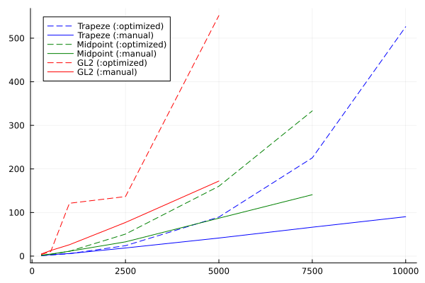

# Benchmark for different AD backends
The backend for ADNLPModels can be set in transcription / solve calls with the option `adnlp_backend=`. Possible values include the predefined(*) backends for ADNLPModels:
- `:optimized`* Default for CTDirect. Forward mode for Jacobian, reverse for Gradient and forward over reverse for Hessian.
- `:default`* Forward mode only. Significantly slower, but more rugged.
- `:manual` Explicitely give to ADNLPModels the sparse pattern for Jacobian and Hessian. Uses the same forward / reverse settings as the `:optimized` predefined backend.  
- `:enzyme`* Enzyme (currently not working).

## Tests:
```
julia> include("test/benchmark.jl")
test_unit (generic function with 1 method)

julia> bench(grid_size_list=[250,500,1000,2500,5000,7500,10000], adnlp_backend=:manual)
Problem list: ["beam", "double_integrator_mintf", "double_integrator_minenergy", "double_integrator_freet0tf", "fuller", "goddard", "goddard_all", "jackson", "simple_integrator", "vanderpol"]
```

Takeaways:
- the `:optimized` backend (with forward over reverse mode for Hessian) is much faster than full forward mode, but does not scale greatly. This is likely due to the increasing cost of computing the Hessian sparsity with SparseConnectivityTracer.jl in terms of allocations and time. Note that the `:default` backend that uses forward mode only may still be useful when having AD errors.
- manual sparse pattern seems to give better performance for larger problems. See also the comparison with Jump that seems to use a different, less sparse but faster method for the Hessian. The sparsity pattern detection in JuMP relies on the expression tree of the objective and constraints built from its DSL.



Standard benchmark for Trapeze:
| Trapeze | default | optimized | manual   |
|---------|---------|-----------|----------|
| 250     | 51.9    | 0.8       | 1.4      |
| 500     | 219.0   | 2.0       | 3.1      |
| 1000    | 858.8   | 5.2       | 5.4      |
| 2500    | 6932.1  | 20.9      | 17.1     |
| 5000    |         | 73.0      | 34.1     |
| 7500    |         | 200.6     | 53.1     |
| 10000   |         | 415.7     | 70.4     |

* (older version) build sparse matrices from dense boolean matrices
** build sparse matrices from (i,j,v) vectors

Standard benchmark for Midpoint:
| Midpoint| optimized | manual |
|---------|-----------|--------|
| 250     | 1.4       | 2.1    |
| 500     | 3.4       | 4.2    |
| 1000    | 10.0      | 10.2   |
| 2500    | 45.0      | 30.0   |
| 5000    | 150.1     | 79.0   |
| 7500    | 322.6     | 130.7  |

Standard benchmark for Gauss Legendre 2:
| GL2     | optimized | manual |
|---------|-----------|--------|
| 250     | 3.5       | 4.3    |
| 500     | 9.6       | 11.5   |
| 1000    | 125.5     | 22.3   |
| 2500    | 135.0     | 68.3   |
| 5000    | 527.7     | 156.8  |

Sparsity details: goddard_all Trapeze (1000 and 10000 steps)
| transcription | optimized | manual     | optimized | manual  |
|---------------|-----------|------------|-----------|---------|
| NLP vars      | 4005      | 4005       | 40005     | 40005   |
| NLP cons      | 6007      | 6007       | 60007     | 60007   |
| Hess nnz      | 11011     | 30024      | 110011    | 300024  |
| H sparsity    | 99.86%    | 99.63%     | 99.99%    | 99.96%  |
| Jac nnz       | 28011     | 42043      | 280011    | 420043  |
| J sparsity    | 99.88%    | 99.83%     | 99.99%    | 99.98%  |
| allocs        | 1.2GB     | 92MB       | 71.6GB    | 0.88 GB |
| time          | 750ms     | 95ms       | 64.7s***  | 2.5s    |

*** hessian accounts for 59 out of total 65s
```
julia> direct_transcription(goddard_all().ocp, grid_size=10000, show_time=true);
gradient backend ADNLPModels.ReverseDiffADGradient: 0.000137972 seconds;
hprod    backend ADNLPModels.ReverseDiffADHvprod: 0.314931491 seconds;
jprod    backend ADNLPModels.ForwardDiffADJprod: 2.2412e-5 seconds;
jtprod   backend ADNLPModels.ReverseDiffADJtprod: 0.612174104 seconds;
jacobian backend ADNLPModels.SparseADJacobian: 0.425535048 seconds;
hessian  backend ADNLPModels.SparseReverseADHessian: 58.450146911 seconds;
ghjvprod backend ADNLPModels.ForwardDiffADGHjvprod: 4.339e-6 seconds.
```

| solve         | optimized | manual  | optimized | manual  |
|---------------|-----------|---------|-----------|---------|
| iterations    | 42        | 28      | 51        | 29      |
| allocs        | 2.0GB     | 1.2GB   | 87.5GB    | 13.2GB  |
| time          | 2.5s      | 2.6s    | 151.0s*** | 31.6s   |

*** building the hessian is one third of the total solve time...


## Remarks:
- it is better to build the sparse matrices from the index vectors format rather than a dense boolean matrix (10-20% faster). For larger problems it may not be possible to even allocate the boolean matrix (eg. algal bacterial with GL2 at 5000 steps).
- disabling the unused backends for the various matrix products (jprod_backend, jtprod_backend, hprod_backend, ghjvprod_backend) gives a slight increase in performance.

## Todo:
- use automatic differentiation to get the sparsity patterns for first / second derivatives of the OCP functions, and build the Jacobian / Hessian patterns from these instead of assuming full nonzero blocks.
- some gain may be achieved by preallocating the index vectors

## Errors for Enzyme:
- enzyme gives correct nonzero counts for Jacobian and Hessian, but fails with
```
ERROR: Constant memory is stored (or returned) to a differentiable variable.
As a result, Enzyme cannot provably ensure correctness and throws this error.
This might be due to the use of a constant variable as temporary storage for active memory (https://enzyme.mit.edu/julia/stable/faq/#Runtime-Activity).
If Enzyme should be able to prove this use non-differentable, open an issue!
To work around this issue, either:
 a) rewrite this variable to not be conditionally active (fastest, but requires a code change), or
 b) set the Enzyme mode to turn on runtime activity (e.g. autodiff(set_runtime_activity(Reverse), ...) ). This will maintain correctness, but may slightly reduce performance.```
 Error apparently occurs when calling the boundary conditions.
 ```
